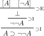

# natural-scheme

Write your natural deduction proof trees using a scheme-like syntax, so that you can use a structural text editor for lisp-like languages
and make the job easier.

Later convert it to latex or to other formats.

Right now there are two latex backends:

- One using prftree, simpler to write for me.
- One using bussproofs, it is compatible with mathjax too, so html compatible!!


For example, in order to get this proof tree:



You can type:

```lisp
(rule-bind "$\supset I$" (binder1)
           (rule-bind "$\supset I$" (binder2)
                      (rule "$\supset E$" (binder1 "A") (binder2 "\neg A") "\bot")
                      "\neg \neg A")
           "A \supset \neg \neg A")
```
